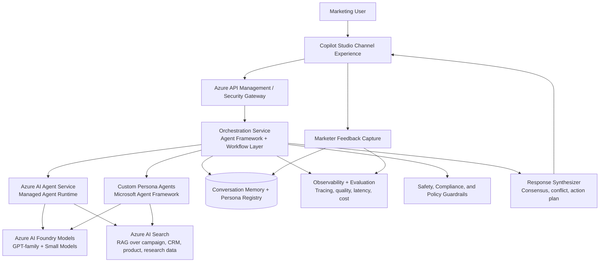

# Agentic Customer Persona System for Marketing Teams

## 1. Goal

Provide marketers with a single chat interface where they can query multiple customer persona agents and receive:

- persona-by-persona reactions
- agreement and disagreement analysis
- prioritized campaign recommendations
- evidence-backed rationale from enterprise data

This architecture uses Microsoft AI technologies:

- Microsoft Copilot Studio
- Azure AI Foundry
- Azure AI Search
- Azure AI Agent Service
- Microsoft Agent Framework

## 2. High-Level Architecture (Microsoft Stack)



## 3. Technology Responsibility Map

| Capability | Primary Microsoft Technology | Why it fits |
|---|---|---|
| Business-facing chat UX | Microsoft Copilot Studio | Low-code conversational interface for marketing teams, rapid iteration, connectors, and governance controls. |
| Managed agent hosting | Azure AI Agent Service | Standardized managed runtime for agents, tools, and lifecycle operations. |
| Model lifecycle and model choice | Azure AI Foundry | Central model catalog, deployment, evaluation, and prompt/model experimentation. |
| Grounding and retrieval | Azure AI Search | Hybrid/vector/semantic retrieval for campaign docs, product info, CRM snapshots, and research notes. |
| Complex orchestration and custom persona logic | Microsoft Agent Framework | Pro-code control over routing, planning, multi-agent fan-out, and synthesis behavior. |
| Enterprise controls | Azure API Management + Entra ID + policy services | Access control, rate limiting, tenant separation, and policy enforcement. |
| Quality and monitoring | Foundry eval + telemetry stack | Continuous quality checks, drift detection, and runtime metrics. |

## 4. End-to-End Request Flow

1. Marketer asks a question in Copilot Studio, for example: "How would our personas react to this new loyalty offer?"
2. Copilot Studio sends the request to the orchestration layer through secured APIs.
3. Orchestrator classifies intent and selects relevant personas from the persona registry.
4. Selected persona agents run in parallel via Agent Service and/or custom Agent Framework agents.
5. Each persona agent retrieves evidence via Azure AI Search (RAG).
6. Agents return structured outputs (reaction, objections, motivations, suggested messaging, confidence, citations).
7. Synthesizer combines outputs into a single response with:
   - consensus and disagreement matrix
   - recommended message variants
   - suggested test plan
8. Final response is shown in Copilot Studio.
9. User feedback and outcome signals are logged for continuous improvement.

## 5. Core Logical Components

### 5.1 Experience Layer (Copilot Studio)

- persona selection (single persona vs compare personas)
- reusable prompt templates for campaign critique, message testing, and offer design
- business-safe interaction model for non-technical users

### 5.2 Orchestration Layer (Agent Framework)

- intent routing
- persona fan-out and parallel execution
- timeout and fallback handling
- synthesis and ranking logic

### 5.3 Agent Runtime (Azure AI Agent Service)

- managed execution of persona agents
- tool calling integration
- scalable hosting and lifecycle operations

### 5.4 Intelligence Layer (Foundry + Models)

- model selection by task (reasoning, summarization, extraction)
- prompt and model versioning
- controlled rollout and regression testing

### 5.5 Knowledge Layer (Azure AI Search)

- ingestion pipelines from:
  - campaign briefs and creative history
  - customer interview summaries
  - market and competitor research
  - product/pricing documentation
- hybrid search with semantic reranking
- citation-ready chunks for transparent answers

### 5.6 Governance Layer

- identity and RBAC via Entra ID
- PII filtering and redaction
- content policy checks and tool access boundaries
- audit trails for prompts, outputs, and tool calls

## 6. Persona-as-a-Product: Let Users Build Their Own Personas

Enable a self-service Persona Builder so marketing teams can create and tune persona agents without deep engineering support.

### 6.1 Persona Builder Capabilities

- create persona from template (for example: Price-Sensitive Parent, Premium Early Adopter)
- edit tone, goals, objections, purchase triggers, and decision criteria
- define data visibility boundaries (which indexes and sources a persona can use)
- test persona in a sandbox chat before publishing
- publish persona versions with approval workflow

### 6.2 Persona Definition Contract

Store persona definitions in a registry (database + versioned config).

Example schema:

```yaml
personaId: "budget_family_shopper"
name: "Budget Family Shopper"
segment: "Households with children, value-focused"
instructionProfile:
  goals:
    - "maximize value for money"
    - "avoid hidden costs"
  concerns:
    - "subscription lock-in"
    - "delivery fees"
  decisionSignals:
    - "clear discount"
    - "trusted reviews"
voice:
  style: "practical, skeptical, detail-oriented"
allowedDataSources:
  - "campaign-history-index"
  - "pricing-and-promotions-index"
responseSchema: "personaReactionV1"
safetyPolicy: "marketing-persona-standard"
version: "1.0.0"
status: "draft"
```

### 6.3 Build Paths

- Low-code path: persona configuration UI in Copilot Studio + managed publish flow.
- Pro-code path: Agent Framework persona package with custom tools and advanced logic.

### 6.4 Lifecycle

1. Draft persona
2. Sandbox evaluation with benchmark prompts
3. Human review and approval
4. Publish to production persona catalog
5. Ongoing performance monitoring and periodic recalibration

## 7. Data and Prompt Contracts

Define strict response contracts so synthesis remains deterministic and comparable.

Recommended persona output fields:

- personaName
- summaryReaction
- likelyObjections
- likelyMotivators
- recommendedMessage
- confidenceScore
- evidenceCitations

Recommended synthesis output fields:

- topConsensusPoints
- keyDisagreements
- campaignRisks
- recommendedActions
- experimentPlan

## 8. Security, Compliance, and Reliability Guardrails

- enforce tenant and environment isolation (dev/test/prod)
- require data-source allowlists per persona
- use policy checks before final response rendering
- implement circuit breakers for slow or failing persona agents
- provide graceful degradation (return available persona results with completeness indicator)

## 9. Deployment Topology (Reference)

- Front door: Copilot Studio + API gateway
- Core app services: orchestration service and synthesis service
- Agent runtime: Azure AI Agent Service
- Model and eval plane: Azure AI Foundry
- Knowledge plane: Azure AI Search indexes + ingestion jobs
- State plane: persona registry, session memory, telemetry store

## 10. Implementation Roadmap

### Phase 1 (4-6 weeks)

- 3 to 5 core personas
- basic orchestration and synthesis
- Azure AI Search grounding for key datasets
- Copilot Studio experience for marketers

### Phase 2 (6-10 weeks)

- Persona Builder self-service MVP
- evaluation harness and scorecards in Foundry
- stronger guardrails and audit dashboards

### Phase 3 (ongoing)

- automated persona drift detection
- experiment-driven prompt/model optimization
- advanced segmentation and dynamic persona composition

## 11. Success Metrics

- reduction in campaign concept iteration time
- lift in message relevance scores from user studies
- persona response groundedness and citation coverage
- cost per analyzed campaign scenario
- marketer satisfaction and adoption rate

## 12. Optional Next Artifacts

- sequence diagram for synchronous vs asynchronous persona runs
- persona benchmark dataset and evaluation rubric
- sample API contracts for orchestrator, persona runtime, and synthesis endpoints

## 13. Concrete API Contracts

These contracts assume REST + JSON over HTTPS, fronted by Azure API Management, with Entra ID bearer tokens.

Common headers:

- `Authorization: Bearer <token>`
- `Content-Type: application/json`
- `x-correlation-id: <uuid>`
- `x-tenant-id: <tenant-id>`

### 13.1 Orchestrator API

Base path: `/api/v1/orchestrator`

#### Endpoint: Run Persona Analysis

- Method: `POST`
- Path: `/runs`
- Purpose: fan out to selected persona agents and return synthesized output

Request:

```json
{
  "requestId": "2e83e4e8-a658-4cc5-8672-f154f5947a75",
  "sessionId": "4e56443b-35d2-4fe5-ae6c-120889f1d0f3",
  "user": {
    "id": "user-123",
    "displayName": "Adele Vance",
    "roles": ["marketing-manager"]
  },
  "prompt": "How will our personas react to a 15% annual-plan discount?",
  "personaSelection": {
    "mode": "explicit",
    "personaIds": ["budget_family_shopper", "premium_early_adopter", "skeptical_researcher"]
  },
  "context": {
    "campaignId": "cmp-2026-summer-01",
    "productId": "prod-subscription-plus",
    "market": "US",
    "channel": "email"
  },
  "options": {
    "maxPersonas": 8,
    "timeoutMs": 30000,
    "returnIntermediate": false,
    "strictGrounding": true
  }
}
```

Response:

```json
{
  "runId": "run_01JV7E3S4P5Q9N0X2Y1Z",
  "status": "completed",
  "startedAt": "2026-05-20T16:10:22Z",
  "completedAt": "2026-05-20T16:10:27Z",
  "orchestration": {
    "selectedPersonaIds": ["budget_family_shopper", "premium_early_adopter", "skeptical_researcher"],
    "failedPersonaIds": [],
    "degraded": false
  },
  "personaResults": [
    {
      "personaId": "budget_family_shopper",
      "resultRef": "pr_01JV7E4KFS3S2P"
    },
    {
      "personaId": "premium_early_adopter",
      "resultRef": "pr_01JV7E4M4MKR4W"
    }
  ],
  "synthesis": {
    "consensus": [
      "Discount is attractive when savings are explicit",
      "Trust signals are required near checkout"
    ],
    "disagreements": [
      "Premium persona values exclusivity over discount depth"
    ],
    "recommendedActions": [
      "A/B test price-first vs value-first headline",
      "Add review proof points near CTA"
    ]
  },
  "telemetry": {
    "latencyMs": 4870,
    "promptTokens": 6912,
    "completionTokens": 1543,
    "estimatedCostUsd": 0.84
  }
}
```

#### Endpoint: Get Run Status

- Method: `GET`
- Path: `/runs/{runId}`
- Purpose: poll for long-running or async orchestrations

Response status values:

- `queued`
- `running`
- `completed`
- `partial`
- `failed`

#### Endpoint: Submit Outcome Feedback

- Method: `POST`
- Path: `/runs/{runId}/feedback`
- Purpose: capture marketer ratings and real-world outcome signals

Request:

```json
{
  "rating": 4,
  "notes": "Good objections list, needs stronger B2B framing.",
  "acceptedRecommendations": [
    "A/B test price-first vs value-first headline"
  ],
  "campaignOutcome": {
    "ctrDeltaPct": 6.2,
    "conversionDeltaPct": 2.1
  }
}
```

### 13.2 Persona Runtime API

Base path: `/api/v1/persona-runtime`

#### Endpoint: Execute Persona

- Method: `POST`
- Path: `/personas/{personaId}/execute`
- Purpose: run one persona agent with bounded context and tool policies

Request:

```json
{
  "runId": "run_01JV7E3S4P5Q9N0X2Y1Z",
  "prompt": "How will this discount be perceived?",
  "context": {
    "campaignId": "cmp-2026-summer-01",
    "productId": "prod-subscription-plus",
    "market": "US"
  },
  "grounding": {
    "searchIndex": "marketing-knowledge-index",
    "filters": "market eq 'US' and productId eq 'prod-subscription-plus'",
    "topK": 8
  },
  "constraints": {
    "maxOutputTokens": 700,
    "mustCiteEvidence": true,
    "temperature": 0.4
  }
}
```

Response:

```json
{
  "personaId": "budget_family_shopper",
  "personaVersion": "1.3.2",
  "status": "completed",
  "reaction": {
    "summaryReaction": "Positive if savings are immediate and transparent.",
    "likelyObjections": [
      "Concern about renewal price after first year",
      "Suspicion of hidden fees"
    ],
    "likelyMotivators": [
      "Clear total annual savings",
      "No lock-in messaging"
    ],
    "recommendedMessage": "Save 15% now, cancel anytime, no hidden fees.",
    "confidenceScore": 0.86,
    "evidenceCitations": [
      {
        "sourceId": "doc_campaign_research_2026_q1",
        "chunkId": "chunk_442",
        "title": "Discount sensitivity analysis",
        "url": "https://contoso.sharepoint.com/sites/marketing/research/q1-discount"
      }
    ]
  },
  "usage": {
    "latencyMs": 1260,
    "promptTokens": 1180,
    "completionTokens": 242
  }
}
```

#### Endpoint: Validate Persona Contract

- Method: `POST`
- Path: `/personas/{personaId}/validate`
- Purpose: validate that persona configuration meets required schema and policy

### 13.3 Synthesis API

Base path: `/api/v1/synthesis`

#### Endpoint: Synthesize Persona Outputs

- Method: `POST`
- Path: `/compose`
- Purpose: build cross-persona insight summary and action plan

Request:

```json
{
  "runId": "run_01JV7E3S4P5Q9N0X2Y1Z",
  "personaOutputs": [
    {
      "personaId": "budget_family_shopper",
      "summaryReaction": "Positive if savings are transparent.",
      "confidenceScore": 0.86
    },
    {
      "personaId": "premium_early_adopter",
      "summaryReaction": "Neutral unless premium value remains clear.",
      "confidenceScore": 0.79
    }
  ],
  "strategy": {
    "mode": "weighted-consensus",
    "weights": {
      "budget_family_shopper": 1.0,
      "premium_early_adopter": 0.8
    }
  }
}
```

Response:

```json
{
  "runId": "run_01JV7E3S4P5Q9N0X2Y1Z",
  "synthesisVersion": "2026.05.1",
  "topConsensusPoints": [
    "Savings should be explicit at first glance",
    "Trust and cancellation terms must be visible"
  ],
  "keyDisagreements": [
    "Discount-heavy framing may erode premium perception"
  ],
  "campaignRisks": [
    {
      "risk": "Premium segment churn risk",
      "severity": "medium",
      "mitigation": "Pair discount with premium service differentiators"
    }
  ],
  "recommendedActions": [
    "Run segmented creative variants by audience type",
    "Include annual savings calculator in landing page"
  ],
  "experimentPlan": [
    {
      "hypothesis": "Price-first headline improves CTR for value-sensitive users",
      "primaryMetric": "CTR",
      "segment": "value-sensitive"
    }
  ]
}
```

### 13.4 Error Contract (All APIs)

```json
{
  "error": {
    "code": "PERSONA_POLICY_VIOLATION",
    "message": "Persona attempted access to a non-allowed data source.",
    "target": "grounding.filters",
    "details": [
      {
        "code": "SOURCE_NOT_ALLOWED",
        "message": "Requested source 'finance-sensitive-index' is not in allowlist."
      }
    ],
    "correlationId": "0f8fad5b-d9cb-469f-a165-70867728950e"
  }
}
```

## 14. Starter Persona Registry Schema

This starter design supports versioned personas, publishing workflows, and controlled data-source access.

### 14.1 Logical Entities

- `persona`: stable identity and ownership
- `persona_version`: versioned definition and runtime instructions
- `persona_datasource_allowlist`: source-level access boundaries per version
- `persona_evaluation`: benchmark outcomes per version
- `persona_publish_event`: audit trail for draft, review, publish, retire

### 14.2 Relational DDL (PostgreSQL Starter)

```sql
create table persona (
  persona_id text primary key,
  display_name text not null,
  segment text not null,
  owner_upn text not null,
  created_at timestamptz not null default now(),
  updated_at timestamptz not null default now(),
  is_active boolean not null default true
);

create table persona_version (
  persona_id text not null references persona(persona_id),
  version text not null,
  status text not null check (status in ('draft', 'in_review', 'published', 'retired')),
  instruction_profile jsonb not null,
  voice_profile jsonb not null,
  response_schema text not null,
  safety_policy text not null,
  model_profile jsonb not null,
  created_by text not null,
  created_at timestamptz not null default now(),
  approved_by text,
  approved_at timestamptz,
  primary key (persona_id, version)
);

create table persona_datasource_allowlist (
  persona_id text not null,
  version text not null,
  datasource_id text not null,
  constraints jsonb,
  primary key (persona_id, version, datasource_id),
  foreign key (persona_id, version)
    references persona_version(persona_id, version)
    on delete cascade
);

create table persona_evaluation (
  eval_id bigserial primary key,
  persona_id text not null,
  version text not null,
  eval_suite text not null,
  groundedness_score numeric(5,2),
  relevance_score numeric(5,2),
  toxicity_score numeric(5,2),
  latency_ms_p95 integer,
  executed_at timestamptz not null default now(),
  foreign key (persona_id, version)
    references persona_version(persona_id, version)
    on delete cascade
);

create table persona_publish_event (
  event_id bigserial primary key,
  persona_id text not null,
  version text not null,
  event_type text not null check (event_type in ('created', 'submitted', 'approved', 'published', 'retired')),
  actor text not null,
  notes text,
  occurred_at timestamptz not null default now(),
  foreign key (persona_id, version)
    references persona_version(persona_id, version)
    on delete cascade
);

create index idx_persona_version_status on persona_version(status);
create index idx_persona_eval_lookup on persona_evaluation(persona_id, version, executed_at desc);
```

### 14.3 JSON Schema for Persona Version Payload

```json
{
  "$schema": "https://json-schema.org/draft/2020-12/schema",
  "$id": "https://contoso.ai/schemas/persona-version.schema.json",
  "title": "PersonaVersion",
  "type": "object",
  "required": [
    "personaId",
    "version",
    "status",
    "instructionProfile",
    "voiceProfile",
    "responseSchema",
    "safetyPolicy",
    "modelProfile",
    "allowedDataSources"
  ],
  "properties": {
    "personaId": {
      "type": "string",
      "pattern": "^[a-z0-9_\\-]+$"
    },
    "version": {
      "type": "string",
      "pattern": "^\\d+\\.\\d+\\.\\d+$"
    },
    "status": {
      "type": "string",
      "enum": ["draft", "in_review", "published", "retired"]
    },
    "instructionProfile": {
      "type": "object",
      "required": ["goals", "concerns", "decisionSignals"],
      "properties": {
        "goals": {
          "type": "array",
          "items": { "type": "string" },
          "minItems": 1
        },
        "concerns": {
          "type": "array",
          "items": { "type": "string" }
        },
        "decisionSignals": {
          "type": "array",
          "items": { "type": "string" },
          "minItems": 1
        }
      }
    },
    "voiceProfile": {
      "type": "object",
      "required": ["style"],
      "properties": {
        "style": { "type": "string" },
        "readingLevel": { "type": "string" }
      }
    },
    "responseSchema": {
      "type": "string"
    },
    "safetyPolicy": {
      "type": "string"
    },
    "modelProfile": {
      "type": "object",
      "required": ["model", "temperature", "maxOutputTokens"],
      "properties": {
        "model": { "type": "string" },
        "temperature": { "type": "number", "minimum": 0, "maximum": 2 },
        "maxOutputTokens": { "type": "integer", "minimum": 128, "maximum": 4096 }
      }
    },
    "allowedDataSources": {
      "type": "array",
      "items": {
        "type": "object",
        "required": ["datasourceId"],
        "properties": {
          "datasourceId": { "type": "string" },
          "constraints": { "type": "object" }
        }
      }
    }
  }
}
```

### 14.4 Minimal Starter Records

```sql
insert into persona(persona_id, display_name, segment, owner_upn)
values
('budget_family_shopper', 'Budget Family Shopper', 'Value-focused households', 'marketing.ops@contoso.com'),
('premium_early_adopter', 'Premium Early Adopter', 'High-intent premium buyers', 'marketing.ops@contoso.com');
```
