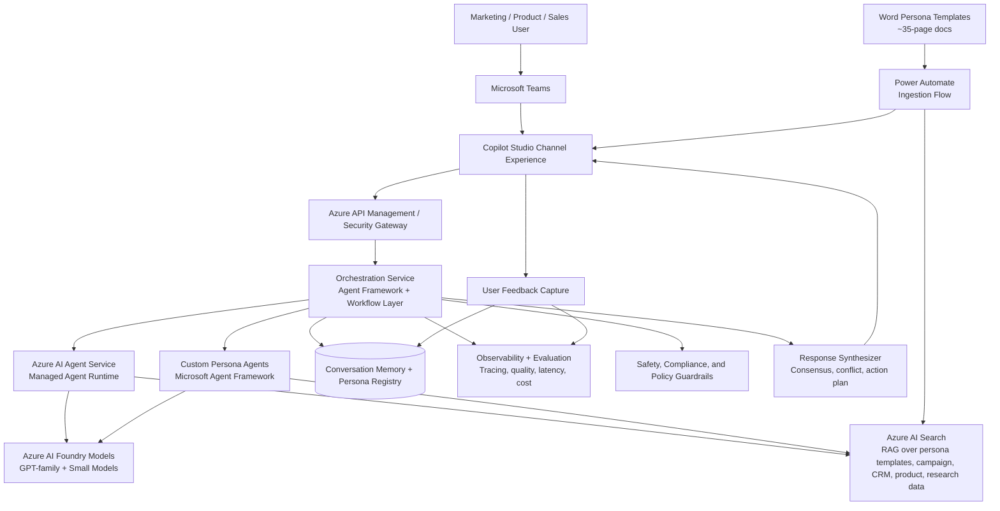

# Agentic Customer Persona System for Marketing Teams

## 1. Goal

Provide marketing, product, and sales teams with a single chat interface where they can query multiple synthetic customer persona agents and receive:

- persona-by-persona reactions
- agreement and disagreement analysis
- prioritized campaign recommendations
- evidence-backed rationale from enterprise data

### Use Cases

- **Campaign and content testing**: marketers test messaging, offers, and creative before launch
- **Product development feedback**: simulate customer reactions to new features and pricing decisions
- **Sales pitch rehearsal**: test and refine sales narratives against representative buyer personas
- **Customer centricity**: support the organization's strategic focus on deeply understanding customer perspectives

### Project Team

- **Josh Miller** — project lead
- **Tony Truelove** — persona template development and marketing strategy
- **Armando** — technical implementation (Azure AI Foundry, Copilot Studio)
- **Naveen Subramanyam** — Microsoft technical advisor
- **Pete Fuenfhausen** — architecture and engineering
- **Lori Dempsey** — stakeholder

### Current Status (as of June 2026)

Three B2B personas are live in Microsoft Teams: **data center consultant**, **engineer**, and **contractor**. Users can chat with each persona individually and test responses to marketing content and product scenarios.

This architecture uses Microsoft AI technologies:

- Microsoft Copilot Studio (integrated with Microsoft Teams)
- Azure AI Foundry
- Azure AI Search
- Azure AI Agent Service
- Microsoft Agent Framework

## 2. High-Level Architecture (Microsoft Stack)



## 3. Technology Responsibility Map

| Capability | Primary Microsoft Technology | Why it fits |
|---|---|---|
| Business-facing chat UX | Microsoft Copilot Studio (Teams channel) | Low-code conversational interface for marketing and product teams, rapid iteration, connectors, Teams integration, and governance controls. |
| Managed agent hosting | Azure AI Agent Service | Standardized managed runtime for agents, tools, and lifecycle operations. |
| Model lifecycle and model choice | Azure AI Foundry | Central model catalog, deployment, evaluation, and prompt/model experimentation. |
| Grounding and retrieval | Azure AI Search | Hybrid/vector/semantic retrieval for persona templates, campaign docs, product info, CRM snapshots, and research notes. |
| Complex orchestration and custom persona logic | Microsoft Agent Framework | Pro-code control over routing, planning, multi-agent fan-out (ensemble/panel pattern), and synthesis behavior. |
| Flexible skills-based orchestration (future) | Model Context Protocol (MCP) | Composable, protocol-driven tool and skill invocation for dynamic persona composition across large persona catalogs. |
| Template ingestion and agent grounding automation | Power Automate | Orchestrates the Word document → agent grounding pipeline, triggering on new or updated persona templates. |
| Enterprise controls | Azure API Management + Entra ID + policy services | Access control, rate limiting, tenant separation, and policy enforcement. |
| Quality and monitoring | Foundry eval + telemetry stack | Continuous quality checks, drift detection, and runtime metrics. |

## 4. End-to-End Request Flow

1. Marketer asks a question in Copilot Studio, for example: "How would our personas react to this new loyalty offer?"
2. Copilot Studio sends the request to the orchestration layer through secured APIs.
3. Orchestrator classifies intent and selects relevant personas from the persona registry.
4. Selected persona agents run in parallel via Agent Service and/or custom Agent Framework agents.
5. Each persona agent retrieves evidence via Azure AI Search (RAG).
6. Agents return structured outputs (reaction, objections, motivations, suggested messaging, confidence, citations).
7. Synthesizer combines outputs into a single response with:
   - consensus and disagreement matrix
   - recommended message variants
   - suggested test plan
8. Final response is shown in Copilot Studio.
9. User feedback and outcome signals are logged for continuous improvement.

## 5. Core Logical Components

### 5.1 Experience Layer (Copilot Studio)

- persona selection (single persona vs compare personas)
- reusable prompt templates for campaign critique, message testing, and offer design
- business-safe interaction model for non-technical users

### 5.2 Orchestration Layer (Agent Framework)

- intent routing
- persona fan-out and parallel execution (ensemble/panel pattern — one dedicated agent per persona)
- panel discussion mode: multiple agents respond and react to each other's answers in sequence
- timeout and fallback handling
- synthesis and ranking logic

> **Design decision**: The ensemble/panel pattern (dedicated agent per persona) is preferred over a polymorphic agent (single agent switching personas) for marketing research workloads. Dedicated agents avoid persona bleed and produce more consistent, comparable outputs. MCP-based skills composition is planned for Phase 3 to support flexible orchestration at scale across 65+ personas.

### 5.3 Agent Runtime (Azure AI Agent Service)

- managed execution of persona agents
- tool calling integration
- scalable hosting and lifecycle operations

### 5.4 Intelligence Layer (Foundry + Models)

- model selection by task (reasoning, summarization, extraction)
- prompt and model versioning
- controlled rollout and regression testing

### 5.5 Persona Template Ingestion Workflow

Persona templates originate as authored Word documents and follow this pipeline before becoming grounded agents:

1. **Authoring**: A persona starts as a ~10-page brief that is expanded to a ~35-page Word document through deep-thinking prompts and researcher-style elaboration. Templates capture firmographic, demographic, and psychographic attributes.
2. **Conversion (optional)**: Word documents can be converted to structured JSON via Azure AI Document Intelligence (formerly Cognitive Services) to enable machine-readable persona definitions and registry storage.
3. **Grounding**: Agents in Copilot Studio are grounded using either the JSON output or directly from the Word document. Direct Word grounding (bypassing JSON conversion) is the recommended path for simplicity and reduced pipeline complexity.
4. **Power Automate flow**: A Power Automate flow handles the handoff from document storage to Copilot Studio agent configuration, triggering on new or updated template files.
5. **Publish**: Once grounded and validated in sandbox, personas are published to production via the approval workflow in the persona registry.

> **Note**: Direct Word document grounding is the preferred approach. JSON conversion adds flexibility for registry storage and programmatic access but is not required for initial persona activation.

### 5.6 Knowledge Layer (Azure AI Search)

- ingestion pipelines from:
  - persona templates (Word documents and/or JSON)
  - campaign briefs and creative history
  - customer interview summaries
  - market and competitor research
  - product/pricing documentation
- planned future sources: Salesforce (CRM and voice-of-customer data), Eaton.com (product and customer signal data)
- hybrid search with semantic reranking
- citation-ready chunks for transparent answers

### 5.7 Governance Layer

- identity and RBAC via Entra ID
- PII filtering and redaction
- content policy checks and tool access boundaries
- audit trails for prompts, outputs, and tool calls

## 6. Persona-as-a-Product: Let Users Build Their Own Personas

Enable a self-service Persona Builder so marketing teams can create and tune persona agents without deep engineering support.

### 6.1 Persona Builder Capabilities

- create persona from template (for example: Data Center Consultant, Field Engineer, Contractor)
- edit tone, goals, objections, purchase triggers, and decision criteria
- define data visibility boundaries (which indexes and sources a persona can use)
- test persona in a sandbox chat before publishing
- publish persona versions with approval workflow

### 6.2 Persona Template and Definition Contract

#### Template Authoring

Persona templates start as ~10-page briefs and are expanded to ~35-page Word documents through deep-thinking and researcher-style prompting. Each template captures:

- **Firmographic**: industry, company size, role, buying authority
- **Demographic**: seniority, geography, background
- **Psychographic**: goals, concerns, decision signals, motivations, communication style

These Word documents serve as the primary grounding artifact for persona agents.

#### Persona Definition Contract

Store persona definitions in a registry (database + versioned config).

Example schema (B2B — Data Center Consultant):

```yaml
personaId: "data_center_consultant"
name: "Data Center Consultant"
segment: "B2B — Infrastructure and facilities decision influencers"
instructionProfile:
  goals:
    - "recommend reliable, energy-efficient infrastructure solutions"
    - "minimize total cost of ownership for clients"
  concerns:
    - "vendor lock-in and long support cycles"
    - "integration complexity with existing systems"
  decisionSignals:
    - "proven reference customers in similar environments"
    - "clear ROI and payback period"
voice:
  style: "technical, evidence-driven, skeptical of marketing claims"
allowedDataSources:
  - "product-specs-index"
  - "campaign-history-index"
  - "competitor-research-index"
responseSchema: "personaReactionV1"
safetyPolicy: "marketing-persona-standard"
version: "1.0.0"
status: "draft"
```

### 6.3 Build Paths

- Low-code path: persona configuration UI in Copilot Studio + managed publish flow.
- Pro-code path: Agent Framework persona package with custom tools and advanced logic.

### 6.4 Lifecycle

1. Draft persona
2. Sandbox evaluation with benchmark prompts
3. Human review and approval
4. Publish to production persona catalog
5. Ongoing performance monitoring and periodic recalibration

## 7. Data and Prompt Contracts

Define strict response contracts so synthesis remains deterministic and comparable.

Recommended persona output fields:

- personaName
- summaryReaction
- likelyObjections
- likelyMotivators
- recommendedMessage
- confidenceScore
- evidenceCitations

Recommended synthesis output fields:

- topConsensusPoints
- keyDisagreements
- campaignRisks
- recommendedActions
- experimentPlan

## 8. Security, Compliance, and Reliability Guardrails

- enforce tenant and environment isolation (dev/test/prod)
- require data-source allowlists per persona
- use policy checks before final response rendering
- implement circuit breakers for slow or failing persona agents
- provide graceful degradation (return available persona results with completeness indicator)

## 9. Known Platform Constraints and Mitigations

These constraints were identified during initial implementation and working sessions.

| Constraint | Detail | Recommended Mitigation |
|---|---|---|
| Copilot Studio 2,000-character input limit | Passing large documents or full web page content as input causes agent crashes | Chunk documents before passing to agents; add explicit instructions to limit output length; use Azure AI Search retrieval (RAG) rather than full-document injection |
| Teams group chat agent tagging | In Teams group chats, users must tag each agent individually per turn; agents do not proactively reply without being addressed | Expected platform behavior; improvements to agent identity and governance are on the Microsoft roadmap |
| Large persona template grounding | 35-page Word documents exceed comfortable context window sizes for some operations | Prefer chunked AI Search indexing over raw document injection; use direct Word grounding only for per-agent system prompt setup |
| External platform data access restrictions | Salesforce and Eaton.com may impose restrictions on AI system access to their data feeds | Validate data access agreements early; consider scheduled extract-and-index pipelines as an alternative to live connectors |
| Polymorphic agent context switching | A single agent assuming multiple personas in one session risks persona bleed and inconsistent voice | Prefer the ensemble/panel pattern (one dedicated agent per persona) over polymorphic agents for marketing research workloads |

## 10. Deployment Topology (Reference)

- Front door: Copilot Studio (Teams channel) + API gateway
- Template ingestion: Power Automate flow (Word/JSON → Copilot Studio agent grounding)
- Core app services: orchestration service and synthesis service
- Agent runtime: Azure AI Agent Service
- Model and eval plane: Azure AI Foundry
- Knowledge plane: Azure AI Search indexes + ingestion jobs
- State plane: persona registry, session memory, telemetry store

## 11. Implementation Roadmap

### Phase 1 — Foundation (Completed)

- Three B2B personas live in Teams: data center consultant, engineer, contractor
- Copilot Studio channel experience integrated with Microsoft Teams
- Azure AI Foundry grounding and initial persona template workflow
- Word document template authoring and agent grounding via Power Automate

### Phase 2 (6–10 weeks)

- Persona Builder self-service MVP for non-technical persona authors
- Evaluation harness and scorecards in Foundry (benchmark prompts per persona)
- Stronger guardrails, audit dashboards, and PII controls
- Knowledge management pattern for versioning and managing up to 65 personas across 8 market segments
- Direct Word document grounding validation and optimization
- Panel/ensemble orchestration improvements (multi-persona simultaneous responses)

### Phase 3 — Scale and Real-Time Data (Ongoing)

- Real-time customer feedback integration from Salesforce and Eaton.com
- Dynamic persona template updates driven by live voice-of-customer signals
- Automated persona drift detection and recalibration
- MCP (Model Context Protocol) and skills-based orchestration for flexible agent composition
- Experiment-driven prompt and model optimization
- Advanced segmentation and dynamic persona composition across all market segments

## 12. Success Metrics

- reduction in campaign concept iteration time
- lift in message relevance scores from user studies
- persona response groundedness and citation coverage
- cost per analyzed campaign scenario
- marketer satisfaction and adoption rate

## 12. Optional Next Artifacts

- sequence diagram for synchronous vs asynchronous persona runs
- persona benchmark dataset and evaluation rubric
- sample API contracts for orchestrator, persona runtime, and synthesis endpoints

## 13. Concrete API Contracts

These contracts assume REST + JSON over HTTPS, fronted by Azure API Management, with Entra ID bearer tokens.

Common headers:

- `Authorization: Bearer <token>`
- `Content-Type: application/json`
- `x-correlation-id: <uuid>`
- `x-tenant-id: <tenant-id>`

### 13.1 Orchestrator API

Base path: `/api/v1/orchestrator`

#### Endpoint: Run Persona Analysis

- Method: `POST`
- Path: `/runs`
- Purpose: fan out to selected persona agents and return synthesized output

Request:

```json
{
  "requestId": "2e83e4e8-a658-4cc5-8672-f154f5947a75",
  "sessionId": "4e56443b-35d2-4fe5-ae6c-120889f1d0f3",
  "user": {
    "id": "user-123",
    "displayName": "Adele Vance",
    "roles": ["marketing-manager"]
  },
  "prompt": "How will our personas react to this new power distribution product announcement?",
  "personaSelection": {
    "mode": "explicit",
    "personaIds": ["data_center_consultant", "field_engineer", "contractor"]
  },
  "context": {
    "campaignId": "cmp-2026-datacenter-launch",
    "productId": "prod-power-distribution-v2",
    "market": "US",
    "channel": "email"
  },
  "options": {
    "maxPersonas": 8,
    "timeoutMs": 30000,
    "returnIntermediate": false,
    "strictGrounding": true
  }
}
```

Response:

```json
{
  "runId": "run_01JV7E3S4P5Q9N0X2Y1Z",
  "status": "completed",
  "startedAt": "2026-05-20T16:10:22Z",
  "completedAt": "2026-05-20T16:10:27Z",
  "orchestration": {
    "selectedPersonaIds": ["data_center_consultant", "field_engineer", "contractor"],
    "failedPersonaIds": [],
    "degraded": false
  },
  "personaResults": [
    {
      "personaId": "data_center_consultant",
      "resultRef": "pr_01JV7E4KFS3S2P"
    },
    {
      "personaId": "field_engineer",
      "resultRef": "pr_01JV7E4M4MKR4W"
    }
  ],
  "synthesis": {
    "consensus": [
      "Product reliability and long support lifecycle are critical",
      "ROI evidence and reference customers are required to progress"
    ],
    "disagreements": [
      "Consultant prioritizes vendor ecosystem fit; contractor prioritizes installation simplicity"
    ],
    "recommendedActions": [
      "Lead with uptime and support SLA data",
      "Provide installation guide and compatibility matrix"
    ]
  },
  "telemetry": {
    "latencyMs": 4870,
    "promptTokens": 6912,
    "completionTokens": 1543,
    "estimatedCostUsd": 0.84
  }
}
```

#### Endpoint: Get Run Status

- Method: `GET`
- Path: `/runs/{runId}`
- Purpose: poll for long-running or async orchestrations

Response status values:

- `queued`
- `running`
- `completed`
- `partial`
- `failed`

#### Endpoint: Submit Outcome Feedback

- Method: `POST`
- Path: `/runs/{runId}/feedback`
- Purpose: capture marketer ratings and real-world outcome signals

Request:

```json
{
  "rating": 4,
  "notes": "Good objections list, needs stronger B2B framing.",
  "acceptedRecommendations": [
    "A/B test price-first vs value-first headline"
  ],
  "campaignOutcome": {
    "ctrDeltaPct": 6.2,
    "conversionDeltaPct": 2.1
  }
}
```

### 13.2 Persona Runtime API

Base path: `/api/v1/persona-runtime`

#### Endpoint: Execute Persona

- Method: `POST`
- Path: `/personas/{personaId}/execute`
- Purpose: run one persona agent with bounded context and tool policies

Request:

```json
{
  "runId": "run_01JV7E3S4P5Q9N0X2Y1Z",
  "prompt": "How will this discount be perceived?",
  "context": {
    "campaignId": "cmp-2026-summer-01",
    "productId": "prod-subscription-plus",
    "market": "US"
  },
  "grounding": {
    "searchIndex": "marketing-knowledge-index",
    "filters": "market eq 'US' and productId eq 'prod-subscription-plus'",
    "topK": 8
  },
  "constraints": {
    "maxOutputTokens": 700,
    "mustCiteEvidence": true,
    "temperature": 0.4
  }
}
```

Response:

```json
{
  "personaId": "data_center_consultant",
  "personaVersion": "1.0.0",
  "status": "completed",
  "reaction": {
    "summaryReaction": "Cautiously positive if reliability specs and reference customers are provided.",
    "likelyObjections": [
      "Needs validated uptime data from comparable deployments",
      "Concerned about long-term vendor support and parts availability"
    ],
    "likelyMotivators": [
      "Proven reliability at scale",
      "Clear integration path with existing infrastructure"
    ],
    "recommendedMessage": "Proven in 500+ enterprise data centers, backed by a 10-year support commitment.",
    "confidenceScore": 0.86,
    "evidenceCitations": [
      {
        "sourceId": "doc_campaign_research_2026_q1",
        "chunkId": "chunk_442",
        "title": "Discount sensitivity analysis",
        "url": "https://contoso.sharepoint.com/sites/marketing/research/q1-discount"
      }
    ]
  },
  "usage": {
    "latencyMs": 1260,
    "promptTokens": 1180,
    "completionTokens": 242
  }
}
```

#### Endpoint: Validate Persona Contract

- Method: `POST`
- Path: `/personas/{personaId}/validate`
- Purpose: validate that persona configuration meets required schema and policy

### 13.3 Synthesis API

Base path: `/api/v1/synthesis`

#### Endpoint: Synthesize Persona Outputs

- Method: `POST`
- Path: `/compose`
- Purpose: build cross-persona insight summary and action plan

Request:

```json
{
  "runId": "run_01JV7E3S4P5Q9N0X2Y1Z",
  "personaOutputs": [
    {
      "personaId": "data_center_consultant",
      "summaryReaction": "Cautiously positive if reliability evidence is provided.",
      "confidenceScore": 0.86
    },
    {
      "personaId": "field_engineer",
      "summaryReaction": "Positive if installation process is simple and well-documented.",
      "confidenceScore": 0.79
    }
  ],
  "strategy": {
    "mode": "weighted-consensus",
    "weights": {
      "data_center_consultant": 1.0,
      "field_engineer": 0.8
    }
  }
}
```

Response:

```json
{
  "runId": "run_01JV7E3S4P5Q9N0X2Y1Z",
  "synthesisVersion": "2026.05.1",
  "topConsensusPoints": [
    "Reliability evidence and reference customers are decisive",
    "Long-term support commitment must be clearly stated"
  ],
  "keyDisagreements": [
    "Consultant focuses on ecosystem fit; engineer focuses on on-site ease of installation"
  ],
  "campaignRisks": [
    {
      "risk": "Technical credibility gap if specs are vague",
      "severity": "high",
      "mitigation": "Include validated performance data and third-party certifications"
    }
  ],
  "recommendedActions": [
    "Run segmented creative variants by audience type",
    "Include annual savings calculator in landing page"
  ],
  "experimentPlan": [
    {
      "hypothesis": "Price-first headline improves CTR for value-sensitive users",
      "primaryMetric": "CTR",
      "segment": "value-sensitive"
    }
  ]
}
```

### 13.4 Error Contract (All APIs)

```json
{
  "error": {
    "code": "PERSONA_POLICY_VIOLATION",
    "message": "Persona attempted access to a non-allowed data source.",
    "target": "grounding.filters",
    "details": [
      {
        "code": "SOURCE_NOT_ALLOWED",
        "message": "Requested source 'finance-sensitive-index' is not in allowlist."
      }
    ],
    "correlationId": "0f8fad5b-d9cb-469f-a165-70867728950e"
  }
}
```

## 14. Starter Persona Registry Schema

This starter design supports versioned personas, publishing workflows, and controlled data-source access.

### 14.1 Logical Entities

- `persona`: stable identity and ownership
- `persona_version`: versioned definition and runtime instructions
- `persona_datasource_allowlist`: source-level access boundaries per version
- `persona_evaluation`: benchmark outcomes per version
- `persona_publish_event`: audit trail for draft, review, publish, retire

### 14.2 Relational DDL (PostgreSQL Starter)

```sql
create table persona (
  persona_id text primary key,
  display_name text not null,
  segment text not null,
  owner_upn text not null,
  created_at timestamptz not null default now(),
  updated_at timestamptz not null default now(),
  is_active boolean not null default true
);

create table persona_version (
  persona_id text not null references persona(persona_id),
  version text not null,
  status text not null check (status in ('draft', 'in_review', 'published', 'retired')),
  instruction_profile jsonb not null,
  voice_profile jsonb not null,
  response_schema text not null,
  safety_policy text not null,
  model_profile jsonb not null,
  created_by text not null,
  created_at timestamptz not null default now(),
  approved_by text,
  approved_at timestamptz,
  primary key (persona_id, version)
);

create table persona_datasource_allowlist (
  persona_id text not null,
  version text not null,
  datasource_id text not null,
  constraints jsonb,
  primary key (persona_id, version, datasource_id),
  foreign key (persona_id, version)
    references persona_version(persona_id, version)
    on delete cascade
);

create table persona_evaluation (
  eval_id bigserial primary key,
  persona_id text not null,
  version text not null,
  eval_suite text not null,
  groundedness_score numeric(5,2),
  relevance_score numeric(5,2),
  toxicity_score numeric(5,2),
  latency_ms_p95 integer,
  executed_at timestamptz not null default now(),
  foreign key (persona_id, version)
    references persona_version(persona_id, version)
    on delete cascade
);

create table persona_publish_event (
  event_id bigserial primary key,
  persona_id text not null,
  version text not null,
  event_type text not null check (event_type in ('created', 'submitted', 'approved', 'published', 'retired')),
  actor text not null,
  notes text,
  occurred_at timestamptz not null default now(),
  foreign key (persona_id, version)
    references persona_version(persona_id, version)
    on delete cascade
);

create index idx_persona_version_status on persona_version(status);
create index idx_persona_eval_lookup on persona_evaluation(persona_id, version, executed_at desc);
```

### 14.3 JSON Schema for Persona Version Payload

```json
{
  "$schema": "https://json-schema.org/draft/2020-12/schema",
  "$id": "https://contoso.ai/schemas/persona-version.schema.json",
  "title": "PersonaVersion",
  "type": "object",
  "required": [
    "personaId",
    "version",
    "status",
    "instructionProfile",
    "voiceProfile",
    "responseSchema",
    "safetyPolicy",
    "modelProfile",
    "allowedDataSources"
  ],
  "properties": {
    "personaId": {
      "type": "string",
      "pattern": "^[a-z0-9_\\-]+$"
    },
    "version": {
      "type": "string",
      "pattern": "^\\d+\\.\\d+\\.\\d+$"
    },
    "status": {
      "type": "string",
      "enum": ["draft", "in_review", "published", "retired"]
    },
    "instructionProfile": {
      "type": "object",
      "required": ["goals", "concerns", "decisionSignals"],
      "properties": {
        "goals": {
          "type": "array",
          "items": { "type": "string" },
          "minItems": 1
        },
        "concerns": {
          "type": "array",
          "items": { "type": "string" }
        },
        "decisionSignals": {
          "type": "array",
          "items": { "type": "string" },
          "minItems": 1
        }
      }
    },
    "voiceProfile": {
      "type": "object",
      "required": ["style"],
      "properties": {
        "style": { "type": "string" },
        "readingLevel": { "type": "string" }
      }
    },
    "responseSchema": {
      "type": "string"
    },
    "safetyPolicy": {
      "type": "string"
    },
    "modelProfile": {
      "type": "object",
      "required": ["model", "temperature", "maxOutputTokens"],
      "properties": {
        "model": { "type": "string" },
        "temperature": { "type": "number", "minimum": 0, "maximum": 2 },
        "maxOutputTokens": { "type": "integer", "minimum": 128, "maximum": 4096 }
      }
    },
    "allowedDataSources": {
      "type": "array",
      "items": {
        "type": "object",
        "required": ["datasourceId"],
        "properties": {
          "datasourceId": { "type": "string" },
          "constraints": { "type": "object" }
        }
      }
    }
  }
}
```

### 14.4 Minimal Starter Records

```sql
insert into persona(persona_id, display_name, segment, owner_upn)
values
('data_center_consultant', 'Data Center Consultant', 'B2B — Infrastructure and facilities decision influencers', 'marketing.ops@contoso.com'),
('field_engineer', 'Field Engineer', 'B2B — On-site technical implementers', 'marketing.ops@contoso.com'),
('contractor', 'Contractor', 'B2B — Project-based installation and integration specialists', 'marketing.ops@contoso.com');
```
